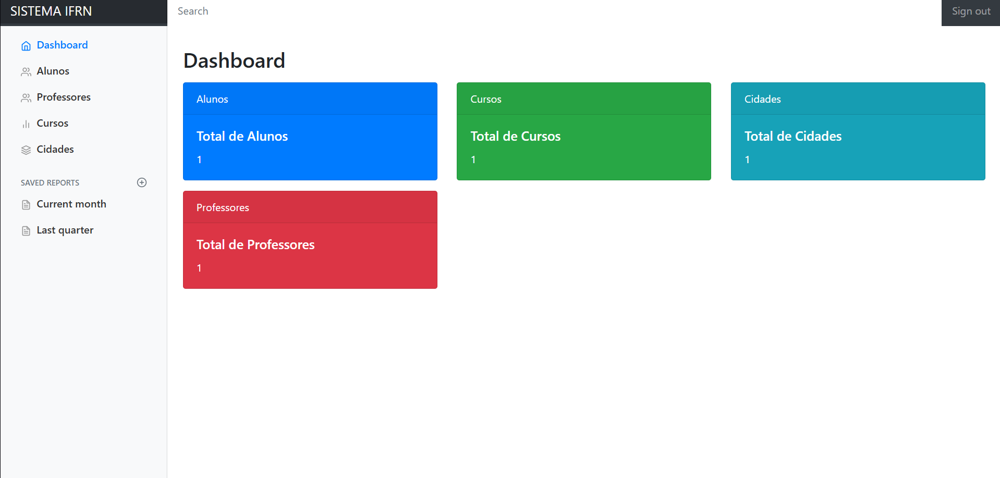
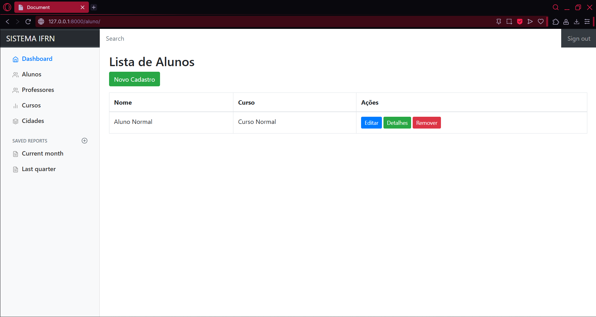
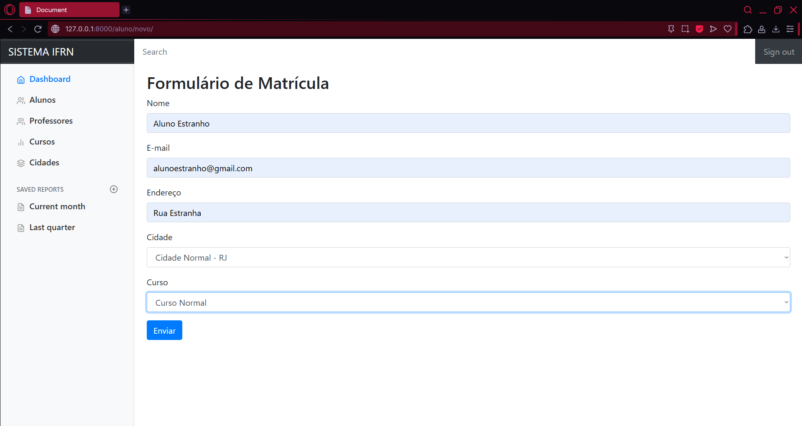
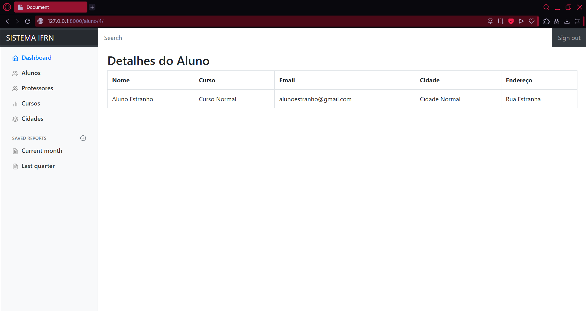
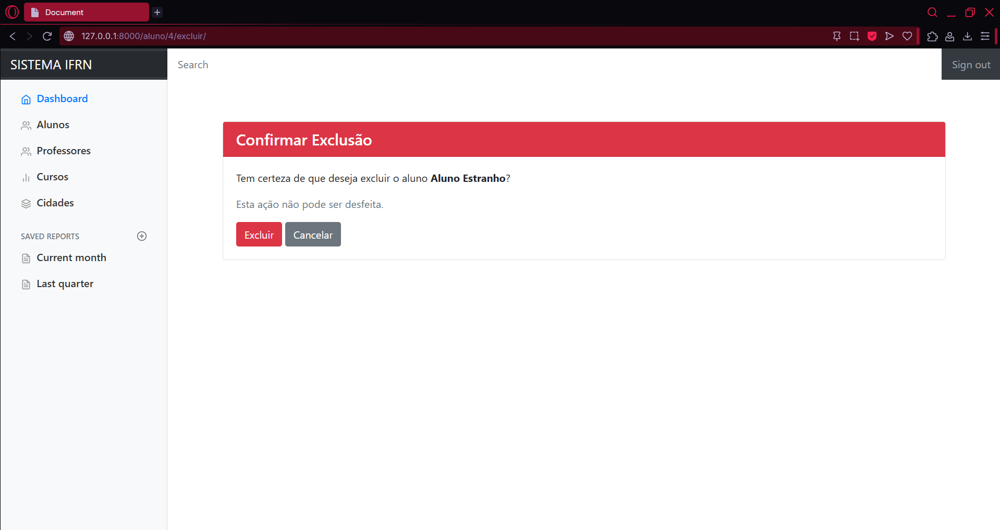

# 🏫 Sistema IFRN — CRUD Completo com Django

Este projeto é um sistema de gerenciamento desenvolvido com **Django**, utilizando **Class-Based Views (CBV)**, Bootstrap e layout administrativo baseado no estilo do IFRN.  
O sistema permite cadastrar, listar, visualizar, editar e excluir:

✅ Alunos  
✅ Professores  
✅ Cursos  
✅ Cidades  

---

## 🚀 Tecnologias utilizadas

- Python 3.11+
- Django 4.x
- Bootstrap 4
- HTML / CSS
- SQLite (padrão do Django)

---

# 📌 **Rotas principais do sistema**

Abaixo estão as rotas principais utilizadas pelas aplicações do projeto.

---

## 🧑‍🎓 **ALUNOS**

| Ação | Método | Rota | Descrição |
|------|--------|-------|-----------|
| Listar alunos | GET | `/aluno/` | Lista todos os alunos cadastrados |
| Criar aluno | GET/POST | `/aluno/novo/` | Formulário para adicionar novo aluno |
| Detalhes do aluno | GET | `/aluno/<id>/` | Exibe informações completas do aluno |
| Editar aluno | GET/POST | `/aluno/<id>/editar/` | Atualiza dados de um aluno existente |
| Remover aluno | GET/POST | `/aluno/<id>/excluir/` | Tela de confirmação para exclusão |

---

## 👨‍🏫 **PROFESSORES**

| Ação | Método | Rota | Descrição |
|------|--------|-------|-----------|
| Listar professores | GET | `/professor/` | Lista todos os professores |
| Criar professor | GET/POST | `/professor/criar/` | Formulário de cadastro |
| Editar professor | GET/POST | `/professor/editar/<id>/` | Atualiza professor existente |
| Remover professor | GET/POST | `/professor/remover/<id>/` | Excluir professor |

---

## 📘 **CURSOS**

| Ação | Método | Rota | Descrição |
|------|--------|-------|-----------|
| Listar cursos | GET | `/curso/` | Lista cursos registrados |
| Criar curso | GET/POST | `/curso/criar/` | Novo curso |
| Editar curso | GET/POST | `/curso/editar/<id>/` | Atualizar curso |
| Remover curso | GET/POST | `/curso/remover/<id>/` | Excluir curso |

---

## 🏙️ **CIDADES**

| Ação | Método | Rota | Descrição |
|------|--------|-------|-----------|
| Listar cidades | GET | `/cidade/` | Lista cidades cadastradas |
| Criar cidade | GET/POST | `/cidade/criar/` | Adicionar nova cidade |
| Editar cidade | GET/POST | `/cidade/editar/<id>/` | Atualizar cidade |
| Remover cidade | GET/POST | `/cidade/remover/<id>/` | Excluir cidade |

---

# 📂 Estrutura resumida do projeto

```plaintext
atv_sistema_ifrn/
│
├── aluno/
│   ├── templates/aluno/
│   ├── views.py
│   ├── forms.py
│   ├── urls.py
│
├── professor/
├── curso/
├── cidade/
│
├── main/ (configurações do Django)
│   ├── settings.py
│   ├── urls.py
│
├── static/
├── templates/
│   └── base.html
└── manage.py

## 📸 Telas do Sistema

### 🏠 Dashboard


### 👨‍🎓 Lista de alunos


### ✏️ Criar aluno


### 🔍 Detalhes de um aluno


### ❌ Confirmação de exclusão
